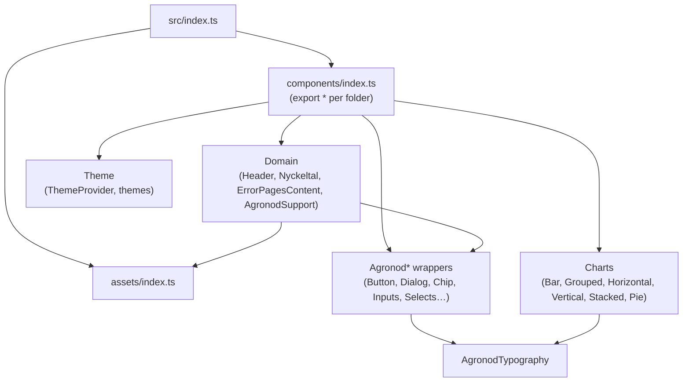

# Component Layer
Keywords: components, Agronod prefix, index barrel, folder structure, stories, Shared Components, Agrosfär Exclusive, naming, exports

## Structure

31 component folders under `src/components/`, plus `src/assets/` (logos, SVG icons, PNG backgrounds), `src/designTokens/` (color palette story) and `src/introPages/` (MDX docs shown in Storybook).

```text
src/components/<Name>/
├── <Name>.tsx            # component, default export + exported Props interface
├── <Name>.stories.tsx    # Storybook stories, one file per component
└── index.ts              # named re-exports only
```

Nested groups exist where components are siblings: `AgronodInputs/{AgronodTextField,AgronodNumberField}`, `AgronodSelects/{AgronodSelect,AgronodSelectChip,AgronodAutocompleteSearch}`, `Loaders/{LoaderLinear,LoadingCircular}`. Sub-parts live in a `components/` folder inside the component (`AgronodSupport/components`).



Dependencies point downward: domain components compose `Agronod*` wrappers, wrappers compose MUI and `AgronodTypography`. Nothing imports back up into `Header` or the charts.

## Naming

- Folder, file and component share one PascalCase name. Wrappers of MUI components carry the `Agronod` prefix (`AgronodDialog` wraps `Dialog`). Domain components do not (`Header`, `Nyckeltal`, `VerticalBarChart`).
- Props type is `<Name>Props`, exported from the component file and re-exported through `index.ts`.
- Swedish domain words are kept as identifiers where they are the product term: `Nyckeltal`, `getNyckeltalVarde`, icon names like `mjolk`, `notkreatur`, `vaxtodling`.

## Export pattern

`index.ts` is the only thing `components/index.ts` re-exports. Component files use a default export; the barrel converts it to a named export:

```ts
import AgronodDialog from "./AgronodDialog";
import type { AgronodDialogProps } from "./AgronodDialog";
export { AgronodDialog, type AgronodDialogProps };
```

A new component is not public until its folder is added to `src/components/index.ts`.

## Story taxonomy

Story `title` decides where a component sits in the Storybook sidebar and in `preview.tsx` `storySort.order`:

- `Shared Components/<Name>` for anything used by both Agronod and Agrosfär (24 stories).
- `Agrosfär Exclusive/<Name>` for Agrosfär-only pieces such as `Header` (9 stories).
- `Custom Icons`, `Design Tokens`, `Intro Pages` for the reference pages.

## Rules

- MUST add a story for every new component; there are no unit tests, so stories plus Chromatic are the regression net.
- MUST route new public exports through the folder `index.ts` and `components/index.ts`.
- PREFER extending the MUI props type of the wrapped component rather than redefining props, see [[components/patterns]].
- AVOID default-exporting from `index.ts` files; consumers rely on named imports.

## References
- Key files: `src/components/index.ts`, `src/components/AgronodDialog/`, `src/components/Nyckeltal/index.ts`, `src/assets/index.ts`
- Related contexts: [[components/patterns]], [[theme/overview]], [[storybook/overview]]
