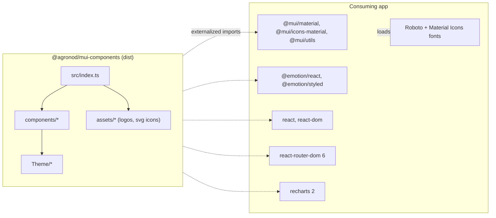

# Library Architecture
Keywords: package, npm, library, build, vite lib mode, exports, dist, ESM, UMD, consumers, Agrosfär, Agronod

## What this is

`@agronod/mui-components` is a React component library published to the GitHub npm registry (`npm.pkg.github.com`) and consumed by Agronod's and Agrosfär's web apps. It wraps MUI v7 with Agronod design tokens, ships two brand themes plus a dark variant, and adds a handful of domain components (charts, Nyckeltal, Header). It has no runtime of its own: nothing here ships a server or a Docker image.

## Topology



Every arrow from `lib` into `app` is an `import` that survives in `dist/index.es.js` untouched. The consuming app owns exactly one copy of React, MUI and Emotion; the library never bundles them. Fonts are the consumer's job, see [[theme/overview]].

## Build

- `npm run build` = `tsc` (type check only, `noEmit`) then `vite build` in lib mode from `src/index.ts`.
- Output: `dist/index.es.js`, `dist/index.umd.js`, and `.d.ts` files via `vite-plugin-dts`. `files` publishes only `dist`.
- `vite.config.ts` externalizes `Object.keys(peerDependencies)`, `Object.keys(dependencies)` and the regex `/^@mui\//`. The regex exists because deep imports such as `@mui/icons-material/Close` do not match an exact package name and were silently bundled before 2026-09. Verify after touching externals:

```bash
npm run build && grep -oE 'from ?"[^"]+"' dist/index.es.js | sort -u
```
Every line must be a declared peer or dependency. A missing package name means it got bundled.

- SVGs are imported as React components through `vite-plugin-svgr` (`?react` suffix), so the plugin and its client types (`tsconfig.json` `types`) are build-time requirements.
- `package.json` `exports` only declares `types` and `import`. The UMD file is not reachable via `exports` and exists for legacy reasons; dropping it is an open decision, see [[library/dependencies]].

## Rules

- MUST keep `src/index.ts` as the single public entry; add new components to `src/components/index.ts`, never to consumers by deep path.
- MUST run the dist import check above whenever `vite.config.ts`, `peerDependencies` or `dependencies` change.
- PREFER importing MUI by package root (`@mui/material`) or documented subpath; both are external.
- AVOID importing a package that is not declared in `package.json`, even if it is present transitively. `@mui/utils` was such a phantom import until it was declared as a peer.

## References
- Key files: `vite.config.ts`, `package.json`, `src/index.ts`, `src/components/index.ts`, `tsconfig-build.json`
- Related contexts: [[library/dependencies]], [[library/release]], [[components/overview]]
