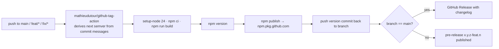

# Release and CI
Keywords: release, publish, version, tag, GitHub Actions, npm publish, changelog, conventional commits, alpha, chromatic, CI

## Release flow

Every push to `main` publishes. Feature and fix branches publish pre-release versions (`pre_release_branches: feat/*,fix/*`) so consumers can test before merge. The version number is derived from conventional commit prefixes, so the commit message decides the bump: `feat:` minor, `fix:` patch, `BREAKING CHANGE:` major.

Paths `.github/**` and `**/*.md` are ignored as triggers, so docs-only commits do not publish.

## Conventions

- Commit messages follow conventional commits (`feat:`, `fix:`, `chore:`). Use the `git:commit` skill. Git history shows the version commits (`1.28.0`) are created by the workflow, not by hand.
- `CHANGELOG.md` is regenerated with `npm run changelog` (conventional-changelog, `react` preset). It is a devDependency task, not a runtime one.
- Branch names `feat/*` and `fix/*` matter: other prefixes neither publish pre-releases nor trigger the workflow. `chore/*` branches must be merged to main to publish.
- Chromatic (`chromatic.yml`) runs on push to `main` only, with `npm install` and the `chromaui/action`. There is no PR-time CI: build, lint and Storybook build are run locally before merging.

## Rules

- MUST keep the release workflow on a supported Node LTS. It sat on Node 18 for months after that runtime left support in 2025-04; moved to 24 on 2026-09-17.
- MUST NOT hand-edit `version` in `package.json`; the workflow does it.
- PREFER publishing an alpha from a `feat/*` branch and testing in a consumer app before merging a component API change.
- AVOID `paths-ignore` surprises: a change only to `.github/**` never publishes, which is intentional.

## References
- Key files: `.github/workflows/release.yml`, `.github/workflows/chromatic.yml`, `CHANGELOG.md`, `package.json` scripts
- Related contexts: [[library/dependencies]], [[storybook/overview]]
