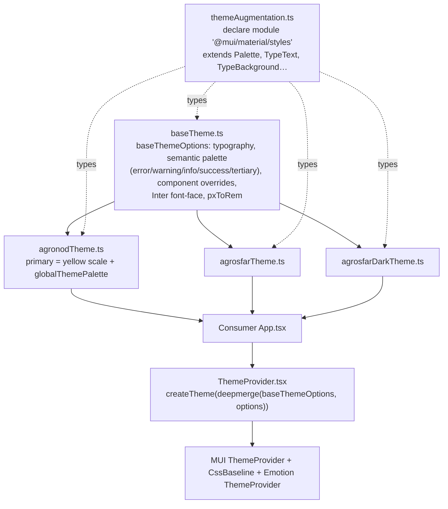

# Theme System
Keywords: theme, ThemeProvider, createTheme, deepmerge, palette, baseTheme, agronodTheme, agrosfarTheme, agrosfarDarkTheme, themeAugmentation, module augmentation, fonts, Inter, Roboto, hint pastel light main medium dark

## Layers



`baseThemeOptions` holds everything shared. A brand theme is a `ThemeOptions` object with its own `primary` scale that the consumer passes to the library's `ThemeProvider`. The provider deep-merges brand options over the base **before** `createTheme`, so MUI derives `light`/`dark`/`contrastText` from the merged palette. Passing the options as a second `createTheme` argument would merge after derivation and is not equivalent; that is why `deepmerge` from `@mui/utils` is imported directly and `@mui/utils` is a declared peer.

## Palette scale

Every semantic and brand colour uses the same seven-step scale: `hint`, `pastel`, `light`, `main`, `medium`, `dark`, plus `*Hover` variants where interaction states exist. These names are not MUI defaults; `themeAugmentation.ts` adds them to `Palette`/`PaletteOptions` so `theme.palette.primary.medium` type-checks. The augmentation is imported for side effects in `ThemeProvider.tsx` (`import "./themeAugmentation"`) and published through the `.d.ts` output, so consumers get the same typings.

Brand theme files compute derived colours with a throwaway theme:

```ts
const tempTheme = createTheme({ palette: agronodThemePalette });
const themePalette = tempTheme.palette;   // then use themePalette.primary.medium in styleOverrides
```
This avoids hard-coding hex values twice.

## Fonts

- **Inter** is bundled: `baseTheme.ts` imports the TTF files from `Theme/fonts/inter/static/` and registers `@font-face` through `MuiCssBaseline` overrides. Vite inlines or emits them into `dist`.
- **Roboto** and **Material Icons** are not bundled. The consuming app loads them (Storybook does it in `.storybook/preview.tsx` via `@fontsource/*`, which is why those packages are devDependencies).

## Exports

`Theme/index.ts` exports `ThemeProvider`, `useTheme` (typed wrapper around MUI's), `baseTheme`, `agronodTheme`, `agrosfarTheme`, `agrosfarDarkTheme`. Storybook's toolbar switches between the three brand themes through the `theme` global in `preview.tsx`.

## Rules

- MUST add new palette keys to `themeAugmentation.ts` first; a key that exists in the object but not in the augmentation compiles in the theme file and fails in every component that reads it.
- MUST keep the `deepmerge`-then-`createTheme` order in `ThemeProvider`.
- PREFER adding component `styleOverrides` in `baseTheme.ts` when they are brand-independent, and in the brand file only when the colour differs per brand.
- AVOID hex literals outside `Theme/`; components read `theme.palette`.
- AVOID `createTheme` in components; the provider is the only place a theme is created at runtime.

## References
- Key files: `src/components/Theme/ThemeProvider.tsx`, `src/components/Theme/baseTheme.ts`, `src/components/Theme/themeAugmentation.ts`, `src/components/Theme/agronodTheme.ts`, `src/components/Theme/fonts/`
- Related contexts: [[components/patterns]], [[storybook/overview]], [[library/dependencies]]
